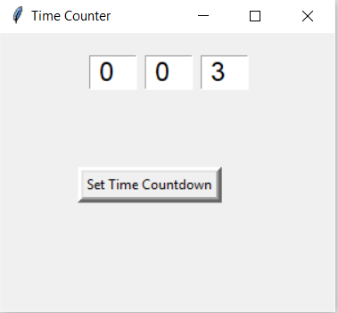
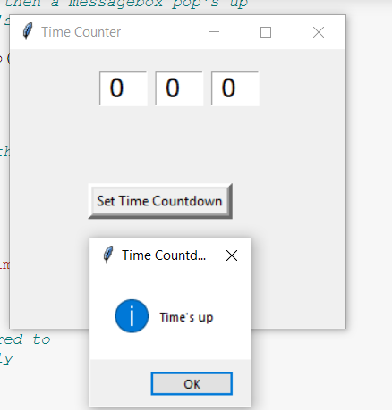
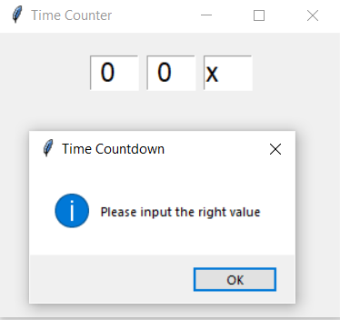

# Count_down_Timer_Python_Gui

Idea Name : 
Countdown Clock and Timer

Description :
You can build a desktop application of a countdown timer in which the user can set a timer and then when the time is completed, the app will notify the user that the time has ended

Team Members:

مريم مصطفى خلف علي
  20170522

أشرقت محمد سيد
20170104

نهال حسن سلامة
20170599

عبد الرحمن رجب محمد
20170287

هدير محمد مبروك
20170632

اسراء سامي عبد الغفار
20170087

Registration sheet row number : 91

Screenshots from our application :

1-Enter the time you need like that

2-you will notify after the time has ended

3-Validation if the enterd value isn't correct

